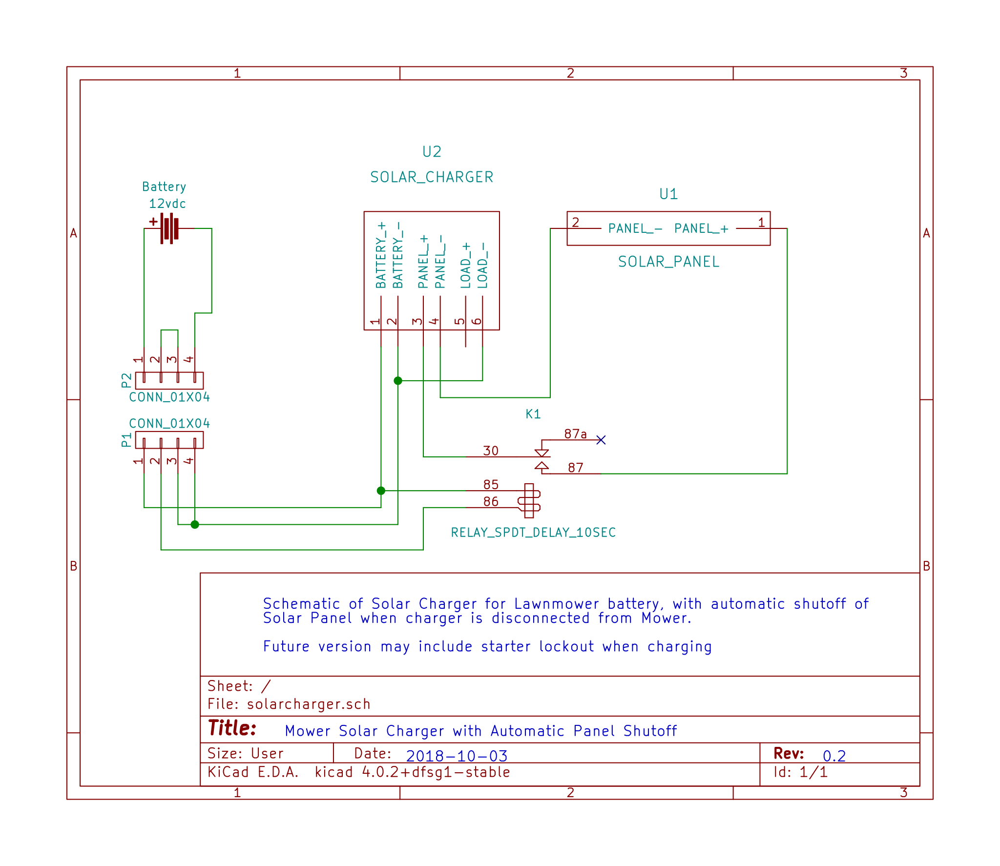

# MowerSolarCharger

I have a small solar panel and charge controller to go with it.
I want to use those to keep the battery in my riding lawn mower topped off when it is not in use.
The problem is, the charge controller requires the battery be connected before the solar panel.
This means juggling the battery and panel connections every time I want to connect or disconnect the mower.

My goal with this project is to design a simple 12 volt system that automatically handles the connection and disconnection of the panel whenever the battery is connected or disconnected.

Once I feel I've successfully reached that goal, I may expand the design to incorporate the mower's starter lockout circuit
(typically used to keep the starter from operating while the cutting blades are engaged)
to prevent the mower from being started while the charger is connected.
This will be an added safety feature to prevent damage to the charge controller should the mower be started when the battery is too weak to properly turn over the starter.

## Materials

This project is planned around the following materials and equipment:

Solar Panel - I acquired a small solar panel at an automotive store some years ago.
Then I discovered it had zero voltage regulation or overcharge protection in it whatsoever.
It's literally a series of solar cells connected to some wire with a 12v accessory plug on the end.
This is why there's a Solar Charge Controller involved

[Solar Charge Controller](http://a.co/d/dpFLoY1) - A simple, inexpensive unit I found on Amazon

[10sec Delay Relay (K1)](http://a.co/d/h7Mtxti) - SPDT 12v automotive relay with a 10-second delay

[Connectors and wire](http://a.co/d/fedNoAV) - 20' 4-pin trailer wiring extension, it will be cut in the "middle" with a short pigtail on the mower and the longer end at the charger.
I chose this because it's a moderately rainproof connector (provided you plug it in _all the way_) with a long history of outdoor use.
It's also easy to find, requires no special tools to terminate, and had enough pins/connections for what I needed (at least three, preferably four)

Other useful things include dust caps for the connectors, relay sockets, and 5/8" split loom to encase the wire.
All of these are optional and can be skipped to save a few dollars.
If you forego the relay sockets, you can get by with female spade connectors.
I've had too many automotive relays die on me over the years to make the all-in commitment of soldering the wires to the terminals.

## Schematic

v0.2 ([PDF](./solarcharger.pdf))

